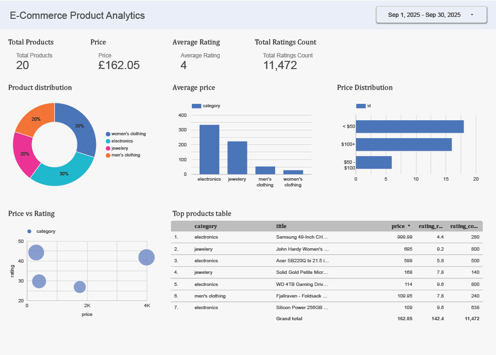

# 🛍️ E-Commerce Analytics Pipeline on Google Cloud Platform

## 📘 Overview
This project demonstrates an **end-to-end ETL + Analytics pipeline** built entirely on **Google Cloud Platform (GCP)**.  

It extracts raw e-commerce product data, transforms and loads it into **BigQuery**, and visualizes insights using **Looker Studio**.  
All steps are automated, scalable, and represent a real-world **data engineering workflow**.

---

## ☁️ Architecture

**Data Flow:**  
`FakeStore API → Cloud Storage (Raw Data) → Cloud Data Fusion (ETL) → BigQuery (Data Warehouse) → Looker Studio (Visualization)`

---

## 🧩 Components Used

### 🪣 Google Cloud Storage (GCS)
- **Bucket Name:** `ecomm-raw-data`
- **Folder:** `/raw/`
- **Purpose:** Stores raw CSV files fetched from the FakeStore API.
- **Example file:** `products_20251019_183154.csv`

📸 *Screenshot:*  
`images/cloud_storage_bucket.png`

---

### ⚙️ Cloud Data Fusion (ETL)
- **Instance ID:** `ecomm-fusion`
- **Region:** `us-central1`
- **Edition:** `Basic`

**Purpose:**  
Orchestrates the ETL pipeline — reads from Cloud Storage, transforms the data, and writes to BigQuery.

**Pipeline Steps**
1. **GCS Source:** Reads CSV from `gs://ecomm-raw-data/raw/`
2. **Wrangler Transform:** Cleans and structures fields (`id`, `title`, `price`, etc.)
3. **BigQuery Sink:** Writes transformed data into `ecommerce_dataset.products`

📸 *Screenshot:*  
`images/datafusion_pipeline.png`

---

### 🧮 BigQuery (Data Warehouse)
- **Dataset:** `ecommerce_dataset`
- **Table:** `products`

**Schema**

| Field | Type | Description |
|-------|------|-------------|
| id | INTEGER | Product ID |
| title | STRING | Product Name |
| description | STRING | Product Description |
| category | STRING | Product Category |
| price | FLOAT | Product Price |
| rating_rate | FLOAT | Average Rating |
| rating_count | INTEGER | Number of Ratings |
| image | STRING | Product Image URL |

## 🧮 Example Aggregation Query

```sql
SELECT
  category,
  COUNT(id) AS total_products,
  ROUND(AVG(price), 2) AS avg_price,
  ROUND(AVG(rating_rate), 2) AS avg_rating,
  SUM(rating_count) AS total_ratings,
  ROUND(SUM(price), 2) AS total_value
FROM `lucid-destiny-475616-t5.ecommerce_dataset.products`
GROUP BY category
ORDER BY avg_rating DESC;


## 🎯 Looker Studio (Visualization)

**Dashboard Name:**  
`E-Commerce Product Analytics`

### 📊 Visuals Included

#### 🧮 Scorecards (KPIs)
Show key performance indicators at the top of your dashboard:
- **Total Products** — Count of all items available  
- **Average Price** — Mean product price across categories  
- **Average Rating** — Average of customer ratings  
- **Total Ratings Count** — Sum of all rating counts  

#### 🥧 Pie Chart: Product Distribution
Displays the percentage of products per category (e.g., Men's Clothing, Electronics, etc.).

#### 📈 Bar Chart: Average Price per Category
Compares the average price across product categories — useful for identifying premium vs budget categories.

#### 💲 Bar Chart: Price Range Distribution
Uses the *Price Range* calculated field to show how many products fall into Low, Medium, or High price ranges.

#### 🎯 Scatter Chart: Price vs Rating
Visualizes correlation between product **price** and **average rating**, helping identify best-value items.

#### 🧾 Detailed Table: Product Information
Tabular view showing each product’s:
- **Title**
- **Price**
- **Category**
- **Average Rating**
- **Rating Count**

## 🎯 Looker Studio (Visualization)

**Dashboard Name:**  
`E-Commerce Product Analytics`



### 📊 Visuals Included

#### 🧮 Scorecards (KPIs)
Display key performance indicators at the top of your dashboard:
- **Total Products** — Count of all available items  
- **Average Price** — Mean product price across categories  
- **Average Rating** — Overall customer satisfaction level  
- **Total Ratings Count** — Sum of all customer reviews  

#### 🥧 Pie Chart: Product Distribution
Shows product distribution across categories such as *Men’s Clothing*, *Women’s Clothing*, *Electronics*, and *Jewelry*.

#### 📈 Bar Chart: Average Price per Category
Compares average product prices per category to identify premium vs budget segments.

#### 💲 Bar Chart: Price Range Distribution
Uses the **Price Range** calculated field to categorize products as:
```sql
CASE
  WHEN price < 50 THEN "Low (<$50)"
  WHEN price BETWEEN 50 AND 200 THEN "Medium ($50–$200)"
  ELSE "High (>$200)"
END
---
###⭐ Rating Bucket
```
CASE
  WHEN rating_rate < 2 THEN "Poor (<2)"
  WHEN rating_rate BETWEEN 2 AND 4 THEN "Average (2–4)"
  ELSE "Excellent (4–5)"
END

---

## 🧱 Project Setup Steps

### 1️⃣ Create a GCP Project
1. Go to the [Google Cloud Console](https://console.cloud.google.com/).
2. Create a new project (e.g., `ecommerce-analytics-project`).
3. Enable the following APIs:
   - **Cloud Storage**
   - **Cloud Data Fusion**
   - **BigQuery**
   - **Looker Studio**
4. Assign IAM roles:
   - `Editor`
   - `Cloud Data Fusion Runner`
   - `BigQuery Admin`

---

### 2️⃣ Extract Data

You can use Python or a Cloud Function to extract product data from the **FakeStore API**.

#### Example Python Script

```python
import requests
import pandas as pd

# Fetch data from FakeStore API
data = requests.get("https://fakestoreapi.com/products").json()

# Convert to DataFrame
df = pd.DataFrame(data)

# Save as CSV
df.to_csv("products.csv", index=False)

print("✅ products.csv file created successfully!")

## 3️⃣ Set Up Cloud Data Fusion

1. **Create an Instance**
   - Instance Name: `ecomm-fusion`

2. **Build a Pipeline**
   - **Source:** GCS (read `products.csv`)
   - **Transform:** Wrangler (clean and format columns)
   - **Sink:** BigQuery table (`ecommerce_dataset.products`)

3. **Run the Pipeline**
   - Execute the pipeline to load data into BigQuery.

---

## 4️⃣ Create Dataset & Table in BigQuery

- **Dataset:** `ecommerce_dataset`  
- **Table:** `products`

💡 *The schema will be automatically generated when the Data Fusion pipeline runs successfully.*

---

## 5️⃣ Build Looker Studio Dashboard

1. **Connect Looker Studio** to the BigQuery table `ecommerce_dataset.products`.

2. **Add Charts and Filters** using:
   - `category`
   - `price`
   - `rating_rate`
   - `rating_count`
   - `title`

3. **Apply Calculated Fields**
   - **Price Range**
   - **Rating Bucket**
## 📊 Example Summary Table

Below is a sample aggregated summary of e-commerce product data analyzed in BigQuery and visualized in Looker Studio.

| Category          | Total Products | Avg Price | Avg Rating | Total Ratings | Total Value |
|-------------------|----------------|------------|-------------|----------------|--------------|
| Men's Clothing    | 4              | 51.06      | 3.70        | 2618           | 408.46       |
| Women's Clothing  | 6              | 26.29      | 3.68        | 3350           | 315.44       |
| Electronics       | 6              | 332.50     | 3.48        | 3564           | 3989.98      |
| Jewelry           | 4              | 221.00     | 3.35        | 1940           | 1767.96      |

---

✅ **Insights:**
- **Men’s & Women’s Clothing** dominate in count but have lower average prices.  
- **Electronics** contribute the highest **total value** despite fewer products.  
- **Jewelry** maintains a **mid-range price** but fewer ratings overall.

---

## 📁 Folder Structure

The project is organized as follows:

ecommerce-analytics-gcp/
├── src/
│ └── extract_fakestore.py
├── data/
│ └── products_*.csv
├── images/
│ ├── cloud_storage_bucket.png
│ ├── datafusion_pipeline.png
│ ├── wrangler_preview.png
│ ├── bigquery_results.png
│ └── looker_studio_dashboard.png
└── README.md

---

## 🚀 Results

✅ **Automated ETL** using Cloud Data Fusion  
✅ **Centralized analytics** in BigQuery  
✅ **Interactive insights** in Looker Studio  
✅ **Fully serverless and scalable** GCP architecture
## 👨‍💻 Author

**Boopathi Raja Mahalingam**  
📧 [mboopathi063@gmail.com](mailto:mboopathi063@gmail.com)
