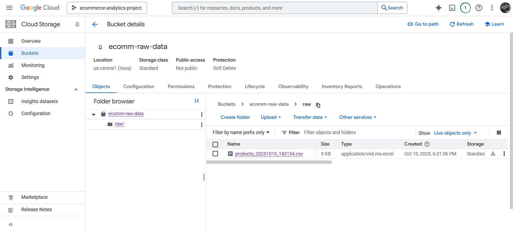
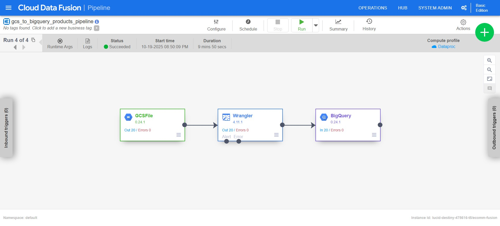

# 🛍️ E-Commerce Analytics Pipeline on Google Cloud Platform

## 📘 Overview
This project demonstrates an **end-to-end ETL + Analytics pipeline** built entirely on **Google Cloud Platform (GCP)**.

It extracts raw e-commerce product data, transforms and loads it into **BigQuery**, and visualizes insights using **Looker Studio**.  
All steps are automated and scalable — a real-world example of a modern data engineering pipeline.

---

## ☁️ Architecture
FakeStore API → Cloud Storage (Raw Data) → Data Fusion (ETL) → BigQuery (Data Warehouse) → Looker Studio (Visualization)

---

## 🧩 Components Used

### 🪣 Google Cloud Storage (GCS)
- **Bucket Name:** `ecomm-raw-data`
- **Folder:** `/raw/`
- Stores raw CSV files fetched from the FakeStore API.
- Example file: `products_20251019_183154.csv`

**Screenshot:**  


---

### ⚙️ Cloud Data Fusion (ETL)
- **Instance ID:** `ecomm-fusion`
- **Region:** `us-central1`
- **Edition:** Basic

**Purpose:**  
Orchestrates the ETL pipeline — reads from Cloud Storage, transforms the data, and writes to BigQuery.

#### Pipeline Steps
1. **GCS Source:** Reads CSV from `gs://ecomm-raw-data/raw/`
2. **Wrangler Transform:** Cleans and structures fields (`id`, `title`, `price`, etc.)
3. **BigQuery Sink:** Writes transformed data into `ecommerce_dataset.products`

**Screenshots:**  
  

---

### 🧮 BigQuery (Data Warehouse)
- **Dataset:** `ecommerce_dataset`
- **Table:** `products`

#### Schema
| Field | Type | Description |
|--------|------|-------------|
| id | INTEGER | Product ID |
| title | STRING | Product Name |
| description | STRING | Product Description |
| category | STRING | Product Category |
| price | FLOAT | Product Price |
| rating_rate | FLOAT | Average Rating |
| rating_count | INTEGER | Number of Ratings |
| image | STRING | Product Image URL |

#### Example Aggregation Query
```sql
SELECT
  category,
  COUNT(id) AS total_products,
  ROUND(AVG(price), 2) AS avg_price,
  ROUND(AVG(rating_rate), 2) AS avg_rating,
  SUM(rating_count) AS total_ratings,
  ROUND(SUM(price), 2) AS total_value
FROM `lucid-destiny-475616-t5.ecommerce_dataset.products`
GROUP BY category
ORDER BY avg_rating DESC;
🎯 Looker Studio (Visualization)
Dashboard Name

E-Commerce Product Analytics

Visuals Included

Scorecards (KPIs)

Total Products

Price

Average Rating

Total Ratings Count

Pie Chart: Product distribution

Bar Chart: Average price

Bar Chart: Price Distribution

Scatter Chart:Price vs Rating

Table with Product details (Title, Price, Rating )

Calculated Fields:
Price Range:
CASE
  WHEN price < 50 THEN "Low (<$50)"
  WHEN price BETWEEN 50 AND 200 THEN "Medium ($50-$200)"
  ELSE "High (>$200)"
END

Rating Bucket:
CASE
  WHEN rating_rate < 2 THEN "Poor (<2)"
  WHEN rating_rate BETWEEN 2 AND 4 THEN "Average (2–4)"
  ELSE "Excellent (4–5)"
END
50    

🧱 Project Setup Steps
1️⃣ Create a GCP Project

Enable APIs: Cloud Storage, Data Fusion, BigQuery, Looker Studio

Configure IAM roles (Editor, Data Fusion Runner, BigQuery Admin)

2️⃣ Extract Data

Use Python or Cloud Function to fetch product data from FakeStore API.

Example:
import requests
import pandas as pd

data = requests.get("https://fakestoreapi.com/products").json()
df = pd.DataFrame(data)
df.to_csv("products.csv", index=False)

3️⃣ Set up Data Fusion

Create instance ecomm-fusion

Build pipeline (GCS → Wrangler → BigQuery)

Run pipeline to load data into BigQuery

4️⃣ Create Dataset & Table in BigQueryDataset: ecommerce_dataset
Table: products

5️⃣ Build Looker Studio Dashboard

Connect BigQuery table

Add charts & filters using fields: category, price, rating_rate, rating_count, title

Apply calculated fields (Price Range, Rating Bucket)

📊 Example Summary Table
Category	Total Products	Avg Price	Avg Rating	Total Ratings	Total Value
Men's Clothing	4	51.06	3.7	2618	408.46
Women's Clothing	6	26.29	3.68	3350	315.44
Electronics	6	332.5	3.48	3564	3989.98
Jewelry	4	221.0	3.35	1940	1767.96
📁 Folder Structure
ecommerce-analytics-gcp/
├── src/
│   └── extract_fakestore.py
├── data/
│   └── products_*.csv
├── images/
│   ├── cloud_storage_bucket.png
│   ├── datafusion_pipeline.png
│   ├── wrangler_preview.png
│   ├── bigquery_results.png
│   └── looker_studio_dashboard.png
└── README.md
🚀 Results

✅ Automated ETL using Cloud Data Fusion
✅ Centralized analytics in BigQuery
✅ Interactive insights in Looker Studio
✅ Fully serverless and scalable GCP architecture
👨‍💻 Author

Boopathi Raja Mahalingam
📧 mboopathi063@gmail.com